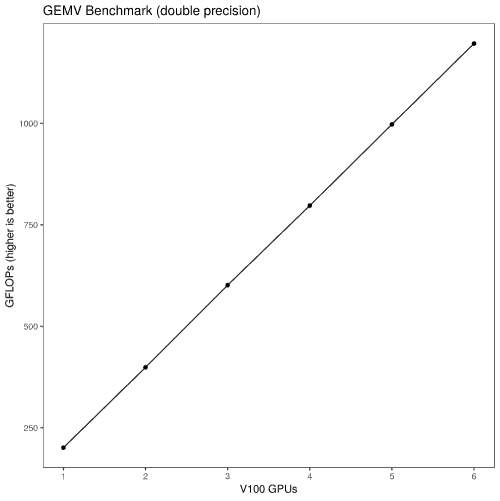

# gemv

A 1-d distributed gemv (dense matrix times vector) benchmark with GPUs (MPI+CUDA). 


## Compiling

You may need to set `MPICXX` in `Makefile.in`, e.g. to `CC` on a Cray. If `configure` can't find `nvcc`, you will need to set `NVCC` and possibly the 


## Benchmark

Here is the result of running on some V100 GPUs:



The benchmark tries to fit a large square matrix in local GPU memory. How big this can be is dependent on a lot of not-very-obvious factors. We query the device to get the maximum amount of GPU RAM, and there's a "backoff" amount (in MiB) you can set in line 5 of `src/gpu_utils.cu`.

The number of total rows of the matrix is the number of rows of the local matrix multiplied by the number of ranks. The number of columns is the same across all ranks; this is also the number of elements of the vector. The communication is an `MPI_Allreduce()` on the vector.

By default the benchmark runs in double precision. You can change to single by changing the end of line 9 of `src/type.h` to `FLOAT`. It is not simple at this time to run in half precision.

There are multiple printer modes. By default it will be human readable, but if you delete the `#define PRINT_VERBOSE` line in `src/main.cxx` then it will print lines in CSV format, with (unprinted) header line:

```
ranks,m,n,size,tgen,tmv,gflops
```
